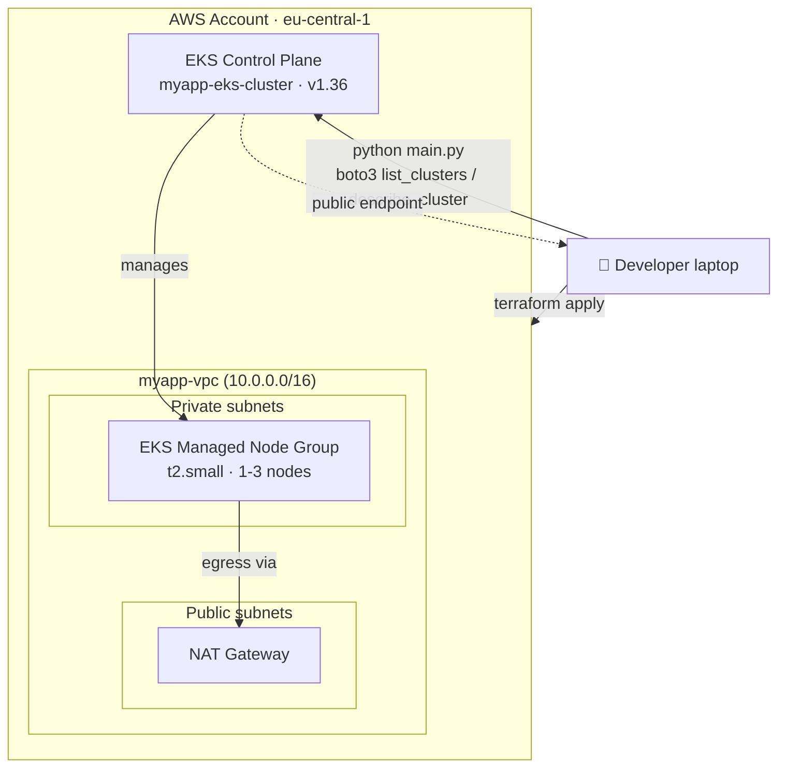
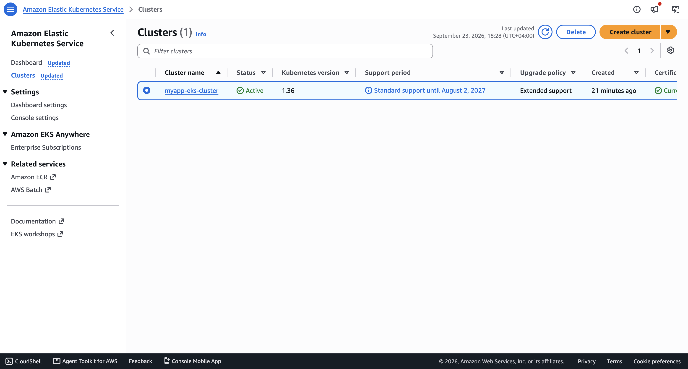
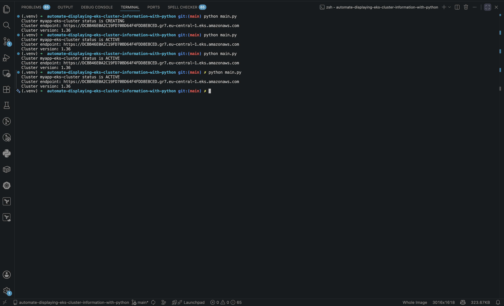

# Automate displaying EKS cluster information with Python

**Terraform** is an infrastructure as code (IaC) tool created by HashiCorp that lets you define, provision, and manage both cloud and on-prem resources through human-readable, declarative configuration files. Instead of clicking through a console or writing imperative scripts, you describe the *desired end state* of your infrastructure, and Terraform figures out the plan needed to create, update, or destroy resources to match it — through a repeatable **Write → Plan → Apply** workflow. It talks to cloud platforms (AWS, Azure, GCP, and hundreds more) through *providers*, which map Terraform configuration to each platform's API.

**Python Automation**, in the context of this project, refers to using the **Python** programming language together with **Boto3** (the AWS SDK for Python) to imperatively query already-provisioned AWS resources — in this case, an Amazon EKS cluster — and surface their live state directly to the console. Where Terraform is declarative and idempotent (great for *provisioning* the cluster), Python is imperative and flexible (great for *operational tasks* like reporting on cluster status, endpoint, and version without needing `kubectl`, the AWS console, or the AWS CLI).

## Overview

This project demonstrates a DevOps workflow that combines **Terraform** for provisioning a production-style Amazon EKS cluster (VPC, managed node group, and control plane) with **Python (Boto3)** for the day-2 operational task of programmatically inspecting that cluster's status. A dedicated VPC with public and private subnets is provisioned first, followed by an EKS cluster with a managed node group running inside the private subnets. A Python script then queries the EKS API directly to list every cluster in the region and print its name, status, endpoint, and Kubernetes version — turning what would otherwise be a manual `aws eks describe-cluster` or console lookup into a reusable, scriptable check.

### Python Automation key features

- 🔌 **Direct AWS API access** via `boto3.client('eks', ...)` — no `kubectl`, `aws-cli`, or `eksctl` binary required to check cluster status.
- 🗂️ **Bulk cluster discovery** with `list_clusters()`, so the script automatically iterates over *every* EKS cluster in the target region instead of requiring a hardcoded cluster name.
- 🩺 **Rich per-cluster reporting** — for each cluster, `describe_cluster()` returns its **status** (e.g. `CREATING`, `ACTIVE`, `UPDATING`), **API server endpoint**, and **Kubernetes version** in a single call.
- 🧩 **Composable by design** — the same loop could be extended to also print `cluster_info['health']`, node group status, or piped into Slack/CloudWatch instead of `print()`, with almost no changes.
- 🌍 **Region-aware** — the `boto3.client('eks', region_name=...)` call scopes every lookup to a single AWS region, matching how EKS clusters are always regional resources.

## Demo Project

Automate displaying EKS cluster information with Python

## Technologies used

- Python
- Boto3
- AWS EKS
- Terraform

## Project Description

- Write a Python script that fetches and displays EKS cluster status and information

## Repository structure

```text
automate-displaying-eks-cluster-information-with-python/
├── README.md                          # This file
├── NOTES.md                           # Raw study notes this project was built from
├── main.py                            # Python script that lists & describes EKS clusters
├── images/                            # Screenshots referenced in this README
│   ├── eks-cluster-aws-console.png    # AWS console view of the provisioned EKS cluster
│   └── eks-cluster-info-python-terminal.png  # Terminal output of the running Python script
└── terraform/                         # Terraform IaC for the demo environment
    ├── providers.tf                   # Terraform + AWS provider version pinning, region
    ├── vpc.tf                         # VPC module: public/private subnets, NAT gateway, EKS tags
    ├── eks-cluster.tf                 # EKS module: cluster, managed node group
    ├── example.tfvars                 # Template variable file (safe to commit, tracked in git)
    └── entry-script.sh                # Leftover EC2 user-data script from an earlier lesson (unused by the EKS module)
```

> 🔒 **Security note:** `.gitignore` excludes every `*.tfvars` file except `example.tfvars`, along with all `*.tfstate*` and `.terraform/` files. This keeps sensitive/environment-specific values and Terraform state — which can contain resource metadata and secrets — out of version control, following Terraform's own recommended practice for handling sensitive data.

## Architecture overview



- **Terraform** provisions the environment in two composable layers: the [`terraform-aws-modules/vpc/aws`](https://registry.terraform.io/modules/terraform-aws-modules/vpc/aws/latest) module builds the networking (public + private subnets across multiple AZs, a single NAT gateway, and the special `kubernetes.io/cluster/*` tags EKS requires to auto-discover subnets), and the [`terraform-aws-modules/eks/aws`](https://registry.terraform.io/modules/terraform-aws-modules/eks/aws/latest) module builds the EKS control plane and a managed node group on top of it.
- The **EKS managed node group** (`dev`) runs worker nodes as `t2.small` EC2 instances inside the **private subnets**, scaling between 1 and 3 nodes, while the control plane's API server is exposed on a **public endpoint** (`cluster_endpoint_public_access = true`) so `kubectl`/Boto3 can reach it from outside the VPC.
- **Python + Boto3** then sits *outside* the Terraform lifecycle entirely — it does not create, update, or destroy anything, it only reads. It calls `eks_client.list_clusters()` to discover every cluster in the region, then `eks_client.describe_cluster(name=cluster)` per cluster to print its **status**, **endpoint**, and **version**.
- Amazon EKS is AWS's fully managed Kubernetes service: AWS operates and scales the Kubernetes control plane for you (API server, etcd, scheduler), while you retain full control over the data plane (worker nodes) — in this project, an EC2-backed managed node group.

## Implementation Guide

### 1. Prerequisites

Before running this project, make sure you have:

- ✅ An **AWS account** with an IAM user/role that has permissions to manage VPCs, subnets, NAT gateways, IAM roles, and EKS clusters/node groups.
- ✅ The **AWS CLI** installed and configured with valid credentials (`aws configure`), since both Terraform's AWS provider and Boto3 rely on the same default credential chain.
- ✅ **Terraform** installed locally (this project was built and pinned against the `hashicorp/aws` provider `~> 5.20.1`, the `terraform-aws-modules/vpc/aws` module `5.2.0`, and the `terraform-aws-modules/eks/aws` module `19.20.0`).
- ✅ **Python 3** installed locally.
- ✅ *(Optional but recommended)* `kubectl` installed if you want to interact with the cluster's Kubernetes API directly, in addition to the Python health check.

```bash
# verify tool versions
terraform -version
python3 --version
aws --version

# verify AWS credentials are wired up correctly
aws sts get-caller-identity
```

### 2. Provision the networking layer with Terraform

`terraform/providers.tf` pins the AWS provider version and sets the target region:

```tf
provider "aws" {
  region = "eu-central-1"
}
```

`terraform/vpc.tf` uses the community [`terraform-aws-modules/vpc/aws`](https://registry.terraform.io/modules/terraform-aws-modules/vpc/aws/latest) module to build a VPC with public and private subnets, and tags them so EKS can auto-discover them for load balancers and internal traffic:

```tf
variable "vpc_cidr_block" {}
variable "private_subnet_cidr_blocks" {}
variable "public_subnet_cidr_blocks" {}

data "aws_availability_zones" "azs" {}

module "myapp-vpc" {
  source  = "terraform-aws-modules/vpc/aws"
  version = "5.2.0"

  name            = "myapp-vpc"
  cidr            = var.vpc_cidr_block
  private_subnets = var.private_subnet_cidr_blocks
  public_subnets  = var.public_subnet_cidr_blocks
  azs             = data.aws_availability_zones.azs.names

  enable_nat_gateway   = true
  single_nat_gateway   = true
  enable_dns_hostnames = true

  tags = {
    "kubernetes.io/cluster/myapp-eks-cluster" = "shared"
  }

  public_subnet_tags = {
    "kubernetes.io/cluster/myapp-eks-cluster" = "shared"
    "kubernetes.io/role/elb"                  = 1
  }

  private_subnet_tags = {
    "kubernetes.io/cluster/myapp-eks-cluster" = "shared"
    "kubernetes.io/role/internal-elb"         = 1
  }
}
```

- `enable_nat_gateway = true` with `single_nat_gateway = true` gives worker nodes in the private subnets outbound internet access (for pulling container images, calling AWS APIs, etc.) through a single, cost-efficient NAT gateway.
- The `kubernetes.io/role/elb` and `kubernetes.io/role/internal-elb` tags are required by the AWS Load Balancer Controller / in-tree cloud provider to automatically place public and internal Kubernetes `Service` load balancers in the correct subnets.

### 3. Provision the EKS cluster with Terraform

`terraform/eks-cluster.tf` uses the community [`terraform-aws-modules/eks/aws`](https://registry.terraform.io/modules/terraform-aws-modules/eks/aws/latest) module to provision the control plane and a managed node group, wired directly to the VPC module's outputs:

```tf
module "eks" {
  source  = "terraform-aws-modules/eks/aws"
  version = "19.20.0"

  cluster_name                   = "myapp-eks-cluster"
  cluster_version                = "1.36"
  cluster_endpoint_public_access = true

  subnet_ids = module.myapp-vpc.private_subnets
  vpc_id     = module.myapp-vpc.vpc_id

  tags = {
    environment = "development"
    application = "myapp"
  }

  eks_managed_node_groups = {
    dev = {
      min_size     = 1
      max_size     = 3
      desired_size = 3

      instance_types = ["t2.small"]
    }
  }
}
```

- `subnet_ids = module.myapp-vpc.private_subnets` places the worker nodes in the private subnets built in the previous step, while `cluster_endpoint_public_access = true` still lets you (and this project's Python script) reach the Kubernetes API server from your local machine.
- `eks_managed_node_groups` declares a single **managed node group** named `dev`, which AWS provisions, patches, and can scale automatically between `min_size` and `max_size` — removing the need to manage EC2 Auto Scaling groups by hand.

Copy the example variables file and fill in your own values before applying:

```bash
cd terraform
cp example.tfvars terraform.tfvars
```

```hcl
# terraform.tfvars
vpc_cidr_block             = "10.0.0.0/16"
private_subnet_cidr_blocks = ["10.0.1.0/24", "10.0.2.0/24", "10.0.3.0/24"]
public_subnet_cidr_blocks  = ["10.0.4.0/24", "10.0.5.0/24", "10.0.6.0/24"]
```

Then initialize and apply the configuration:

```bash
terraform init
terraform plan -var-file terraform.tfvars
terraform apply -var-file terraform.tfvars --auto-approve
```

Once `apply` finishes (EKS control plane provisioning typically takes several minutes), the cluster is visible in the AWS console:



### 4. Install the Python dependencies

The cluster-information script relies on a single third-party package: **Boto3**, for all AWS EKS API calls.

```bash
pip install boto3
```

### 5. Write the EKS cluster information script

`main.py` uses a Boto3 **client** (low-level, direct API mapping) to list every cluster in the region and describe each one:

```py
import boto3

client = boto3.client('eks', region_name="eu-central-1")
clusters = client.list_clusters()['clusters']

for cluster in clusters:
  response = client.describe_cluster(
    name=cluster
  )
  cluster_info = response['cluster']
  cluster_status = cluster_info['status']
  cluster_endpoint = cluster_info['endpoint']
  cluster_version = cluster_info['version']

  print(f"Cluster {cluster} status is {cluster_status}")
  print(f"Cluster endpoint: {cluster_endpoint}")
  print(f"Cluster version: {cluster_version}")
```

- `list_clusters()` returns just the cluster **names** in the region — a separate `describe_cluster(name=...)` call per cluster is required to get its detailed metadata (status, endpoint, version, VPC config, etc.).
- Looping over `clusters` means the script automatically scales to report on any number of clusters in the account/region without code changes.

### 6. Run and test the cluster-information script

With the cluster provisioned and Boto3 installed, simply run the script:

```bash
python main.py
```

The script runs once, prints the current state of every discovered cluster, and exits. Running it at different points in the cluster's lifecycle shows the status transition from `CREATING` to `ACTIVE`:



To tear down the AWS infrastructure once you're done testing:

```bash
cd terraform
terraform destroy -var-file terraform.tfvars --auto-approve
```

## Final result

By combining Terraform and Python in this project, the following was achieved:

- ✅ A fully reproducible, version-controlled Amazon EKS environment (VPC with public/private subnets, NAT gateway, EKS control plane, and a managed node group) stood up with two composed Terraform modules and a single `terraform apply`.
- ✅ A lightweight, dependency-free (beyond `boto3`) Python script capable of discovering and reporting on *any* number of EKS clusters in a region, without needing `kubectl`, the AWS CLI, or console access.
- ✅ Clear, human-readable visibility into each cluster's **status**, **API endpoint**, and **Kubernetes version**, as proven by the terminal capture showing the cluster's transition from `CREATING` to `ACTIVE`.
- ✅ A practical demonstration of *when to reach for Terraform* (predictable, repeatable, module-based infrastructure provisioning) versus *when to reach for Python* (flexible, imperative, on-demand operational automation).

This pattern scales directly into production use cases such as gating a CI/CD deployment step until a cluster reports `ACTIVE`, feeding cluster version data into a compliance/upgrade-tracking dashboard, or building a lightweight multi-cluster status page.

## References

- [Terraform Documentation — What is Terraform?](https://developer.hashicorp.com/terraform/intro)
- [Terraform Registry — `terraform-aws-modules/vpc/aws` module](https://registry.terraform.io/modules/terraform-aws-modules/vpc/aws/latest)
- [Terraform Registry — `terraform-aws-modules/eks/aws` module](https://registry.terraform.io/modules/terraform-aws-modules/eks/aws/latest)
- [AWS Boto3 Documentation](https://boto3.amazonaws.com/v1/documentation/api/latest/index.html)
- [Boto3 EKS Client — `list_clusters`](https://boto3.amazonaws.com/v1/documentation/api/latest/reference/services/eks/client/list_clusters.html)
- [Boto3 EKS Client — `describe_cluster`](https://boto3.amazonaws.com/v1/documentation/api/latest/reference/services/eks/client/describe_cluster.html)
- [AWS EKS User Guide — What is Amazon EKS?](https://docs.aws.amazon.com/eks/latest/userguide/what-is-eks.html)
- [AWS EKS User Guide — Amazon EKS managed node groups](https://docs.aws.amazon.com/eks/latest/userguide/managed-node-groups.html)
- [AWS CLI — Configuration basics](https://docs.aws.amazon.com/cli/latest/userguide/cli-configure-files.html)
